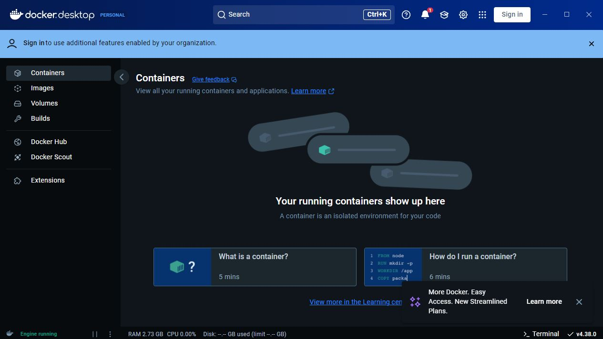

# Anti-TimeSink

## Installation Incstructions 

Open a Powershell prompt as an **Admin** and navigate to your C drive. Once there do the following command: 

``` git clone https://github.com/Parkman97/Anti-TimeSink.git ```

This will download the repo to your current directory 

Next navigate to the folder name that represents the Operting system you are using

For windows: cd .\Windows\

For Mac and Linux cd .Mac-Linux

### Windows

Before you do this next step just an FYI it will force your PC to restart after it is finished installing docker and WSL. Also if prompted hit ok to install docker desktop.

In the powershell prompt type and hit enter:

``` .\install_docker.ps1 ```

After your PC reboots then open the docker desktop app

1) Click Accept 


2) Click Skip

   
3) Click Skip


4) Wait until docker has initialized and the screen looks like this 


5) Open an admin powershell prompt again and go back to C:\Anti-TimeSink\Windows and execute the install script again
   ``` .\install_docker.ps1 ```
### Linux/MacOS
1) Make the sript executable bu running this command:
   ```chmod +x install_docker```

2) Execute the command to start the containers: ./install_docker.sh